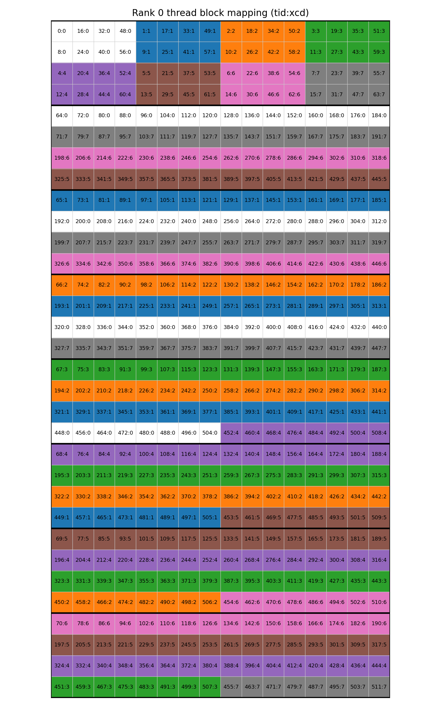

# Optimizing Distributed Inference Kernels for AMD DEVELOPER CHALLENGE 2025: All-to-All, GEMM-ReduceScatter, and AllGather-GEMM

## Authors

YottaLabs

Email: contact@yottalabs.ai

---

## Abstract

This paper presents our optimization work for the AMD Developer Challenge 2025: Distributed Inference Kernels, where we develop high-performance implementations of three critical distributed GPU kernels for single-node 8× AMD MI300X configurations. We optimize All-to-All communication for Mixture-of-Experts (MoE) models, GEMM-ReduceScatter, and AllGather-GEMM kernels through fine-grained per-token synchronization, kernel fusion techniques, and hardware-aware optimizations that leverage MI300X's 8 XCD architecture. These optimizations demonstrate significant performance improvements through communication-computation overlap, reduced memory allocations, and ROCm-specific tuning, providing practical insights for developers working with distributed kernels on AMD GPUs.

**Keywords:** GPU optimization, distributed computing, AMD MI300X, ROCm, RCCL, collective communication, GEMM, Mixture-of-Experts, tensor parallelism, large language models

---

## 1. Introduction

This paper presents our optimization work for the AMD Developer Challenge 2025: Distributed Inference Kernels, where we develop high-performance implementations of three critical distributed GPU kernels for single-node 8× AMD MI300X configurations. The three kernels—All-to-All communication for Mixture-of-Experts (MoE), GEMM-ReduceScatter, and AllGather-GEMM—are fundamental building blocks for modern large language model (LLM) training and inference.

MoE architectures like Mixtral and GPT-4 rely on efficient All-to-All communication to route tokens dynamically across expert networks, enabling models to scale capacity without proportional increases in computation. GEMM-ReduceScatter and AllGather-GEMM are essential for tensor parallelism, the primary technique for training and deploying models that exceed single-GPU memory capacity, as pioneered by systems like Megatron-LM and DeepSpeed. As LLMs continue to grow in size and complexity, optimizing these communication-computation patterns becomes increasingly critical for making AI training and inference practical and cost-effective.

Our key contributions include:

- **Fine-grained per-token synchronization** that enables streaming communication instead of bulk transfers
- **Kernel fusion techniques** that eliminate intermediate memory operations and reduce data movement  
- **Hardware-aware optimizations** that leverage MI300X's 8 XCD architecture for maximum parallelism
- **Custom launchers and barriers** that minimize host-side overhead
- **Comprehensive analysis** of optimization strategies that provide practical insights for AMD GPU developers

We demonstrate significant performance improvements through communication-computation overlap, reduced memory allocations, and ROCm-specific tuning across all three kernels.

---

## 2. Background: The AMD Developer Challenge 2025

The [AMD DEVELOPER CHALLENGE 2025](https://amdchallenge2025.datamonsters.com) aims to advance the state of GPU kernel optimization for AMD hardware by focusing on three critical distributed primitives: All-to-All, GEMM-ReduceScatter, and AllGather-GEMM.

**Challenge Structure**: Participants implement optimized versions of three kernels targeting single-node 8× MI300X configurations. Each kernel has a reference implementation using standard PyTorch distributed primitives, and participants must maintain numerical correctness while improving performance.

**Evaluation Metric**: Performance is measured using the geometric mean across multiple problem sizes, ensuring that solutions perform well across diverse workloads rather than being tuned for specific cases. This metric penalizes solutions that excel on some problems but perform poorly on others.

**Benchmark Configurations**: Each kernel includes 5-6 different problem sizes representing realistic workloads:
- All-to-All: Varying numbers of experts (8-256), experts per token (2-8), hidden dimensions (2048-7168), and token counts (16-256)
- GEMM-ReduceScatter: Matrix dimensions from 64×7168×18432 to 8192×8192×29568, with and without bias
- AllGather-GEMM: Similar range of matrix dimensions with varying configurations


---

## 3. Kernel Implementations and Optimizations

### 3.1 AMD All-to-All Kernel for Mixture-of-Experts

The All-to-All kernel implements the dispatch and combine phases of MoE-style token routing, where tokens are dynamically distributed to expert networks across GPUs and results are gathered back. 

**Reference Implementation Bottlenecks:**

The PyTorch reference implementation uses `torch.distributed.all_to_all_single()` for bulk data transfer, with extensive CPU-side Python loops for metadata processing and token reorganization. It performs separate all-to-all collectives for token data and metadata, creates frequent dynamic allocations with `torch.empty()` and `torch.zeros()`, and processes received data only after complete rank-to-rank transfers finish, resulting in no overlap between communication and computation.

**Our Optimization Strategies:**

Both dispatch and combine kernels are broken down into send and recv parts. The send-kernel copies data from local memory to the symmetric buffer residing in a remote rank, while the recv-kernel copies data out of the symmetric buffer to local memory and re-orders the data received from all other ranks.

**1. Fine-Grained Per-Token Synchronization for Streaming Communication**
- Replace coarse-grained rank-to-rank barriers with per-token flags in symmetric heap
- Send kernels: Write tokens directly to remote GPU memory, then atomically signal completion per token
- Recv kernels: Spin-lock on individual token flags and process tokens immediately as they arrive
- Enables streaming communication instead of waiting for bulk transfers

```cpp
// Send kernel: copy data then signal completion
half *dst_x = translate(comm_x, heap_bases[local_rank], heap_bases[dst_rank]);
dst_x += local_rank * max_num_tokens * topk * DIM;
copy_token<DIM>(dst_x + dst_pos * DIM, pre_x + src_pos * DIM, lane_id);
if (lane_id == 0) {
    __hip_atomic_store(flag_addr, 1, __ATOMIC_RELEASE, __HIP_MEMORY_SCOPE_SYSTEM);
}

// Recv kernel: wait for token then copy
if (lane_id == 0) spin_lock_system(comm_flag + offset);
__builtin_amdgcn_wave_barrier(); // equivalent to __syncwarp()
copy_token<DIM>(post_x + (local_expert_id * max_recv_per_expert + post_pos) * DIM,
                comm_x + offset * DIM, lane_id);
```

**2. Fused MoE Computation with Combine-Send**
- Fuse simulated MoE computation (multiplication by `1 + rank`) directly into combine-send kernel
- Single pass: load → compute → write directly to remote GPU's communication buffer
- Eliminates one full read+write to global memory compared to separate operations

```cpp
// Fused MoE computation with remote write
half *dst_comm_x = translate(comm_x, heap_bases[local_rank], heap_bases[src_rank]);
half *dst_token = dst_comm_x + flat_pos * DIM;
const half *src_token = post_x + idx * DIM;

const float moe_w = 1 + local_rank;
for (int iter = 0; iter < num_iters; iter++) {
    fp16x8 data = reinterpret_cast<const fp16x8 *>(src_token + e_idx)[0];
    for (int i = 0; i < multiplier; i++)
        data[i] = static_cast<_Float16>(static_cast<float>(data[i]) * moe_w);
    reinterpret_cast<fp16x8 *>(dst_token + e_idx)[0] = data;
}
```

**3. Persistent Buffer Reuse with In-Kernel Zeroing**
- Pre-allocate `P2PState` struct with buffers sized for maximum problem dimensions
- Clear buffers inside subsequent kernels instead of using expensive `torch.zeros()` calls
- Example: dispatch-send uses `send_counts` buffer, then dispatch-recv clears it (safe due to implicit kernel synchronization)

```cpp
// dispatch-send: get position using atomicAdd
int dst_pos;
if (lane_id == 0)  // atomic add on lane0 only
    dst_pos = atomicAdd(send_counts + dst_rank, 1);
dst_pos = __shfl(dst_pos, 0);  // warp-broadcast

// dispatch-recv: clear buffer used in previous kernel
if (bid == 0 && tid < WORLD_SIZE)
    send_counts[tid] = 0;
```

**Additional Optimizations:**
- **Symmetric heap**: 10GB heap per GPU using `hipExtMallocWithFlags` with identical memory layout
- **IPC handles**: Direct GPU-to-GPU memory access via `cudaIpcGetMemHandle`/`cudaIpcOpenMemHandle`
- **Vectorized operations**: `fp16x8` operations for coalesced memory access
- **Template specialization**: Dimension-specific kernels (2048/2880/4096/6144/7168) to eliminate runtime branching

```cpp
// Key infrastructure components
hipExtMallocWithFlags(&ptr, size, finegrained);  // Symmetric heap
cudaIpcGetMemHandle(&handle, ptr);               // IPC handles
fp16x8 data = reinterpret_cast<const fp16x8 *>(src + idx)[0];  // Vectorized load
reinterpret_cast<fp16x8 *>(dst + idx)[0] = data;              // Vectorized store
template <int DIM> void kernel() { /* ... */ }   // Template specialization
```

### 3.2 AMD GEMM-ReduceScatter Kernel

The GEMM-ReduceScatter kernel performs matrix multiplication followed by a reduce-scatter collective, commonly used in distributed LLM training for tensor parallelism.

**Reference Implementation Bottlenecks:**

The PyTorch reference implementation uses `torch.matmul()` followed by `torch.distributed.reduce_scatter_tensor()`, creating sequential execution with no communication-computation overlap. It suffers from RCCL overhead and lacks hardware-specific optimizations for MI300X.

**Our Optimization Strategies:**

**1. XCD-Aware Block Remapping with Fused GEMM Epilogue**
- Remap thread blocks across MI300X's 8 XCDs so each XCD processes 1/8 of output matrix rows
- Fuse reduce-scatter communication directly into GEMM epilogue using IPC remote writes
- Each XCD writes partial results directly to remote GPU memory with `.cg` cache modifier
- Enables full utilization of all 7 Infinity Fabric links simultaneously

```python
@triton.jit
def compute_pid(pid, grid_m, grid_n, GROUP_M: tl.constexpr, REMAP_XCD: tl.constexpr = True):
    if REMAP_XCD:
        pid = remap_xcd(pid, grid_m * grid_n)  # XCD-aware remapping
    
    if GROUP_M == 1:
        pid_m = pid // grid_n
        pid_n = pid % grid_n
    else:
        width = GROUP_M * grid_n
        group_id = pid // width
        group_size = min(grid_m - group_id * GROUP_M, GROUP_M)
        pid_m = group_id * GROUP_M + (pid % group_size)
        pid_n = (pid % width) // (group_size)
    return pid_m, pid_n

# Fused GEMM epilogue with remote writes
which_base_use = pid_m // (num_pid_m // 8)
ptr_diff = tl.cast(heap_base_0, tl.int64)
if which_base_use == 1: ptr_diff = tl.cast(heap_base_1, tl.int64)
# ... (similar for other ranks)

offs_cm = (pid_m % (num_pid_m // 8)) * BLOCK_SIZE_M + my_rank * (M // 8) + tl.arange(0, BLOCK_SIZE_M)
offs_cn = pid_n * BLOCK_SIZE_N + tl.arange(0, BLOCK_SIZE_N)
c_ptrs = a_ptr + ptr_diff + stride_cm * offs_cm[:, None] + stride_cn * offs_cn[None, :]
tl.store(c_ptrs, c, cache_modifier=".cg")  # Direct remote write
```

**2. Custom Triton Launcher for Reduced Host Overhead**
- Cache compiled kernel after first warmup and directly call AOT launcher
- Use pointer arithmetic with base tensor (`A_ptr_index_hack`) instead of full tensor objects
- Reduces kernel launch overhead from ~120µs to ~40µs
- Critical for small problem sizes where launch overhead becomes significant

```python
# Custom launcher with cached compilation
ret = triton_mm_kernel[grid]()  # First warmup compilation

# Direct AOT launcher call with pointer arithmetic
ret._run.launch(
    grid[0], grid[1], grid[2], 0, ret.function, None, ret.packed_metadata, 
    LazyDict({"name": ret.name, "function": ret.function, "stream": 0}), 
    None, None,
    A_ptr_index_hack.data_ptr(),  # Base tensor pointer
    (a.data_ptr() - A_ptr_index_hack.data_ptr())//2,  # Offset arithmetic
    b.data_ptr(), bias.data_ptr(),
)
```

**3. Separate Reduce Kernel with Global Barrier**
- Split into two kernels: GEMM with scatter epilogue, then separate reduce kernel
- Use global barrier between kernels to ensure all GPUs complete writes
- Leverages kernel boundaries for automatic coherence control
- Separate reduce kernel achieves full memory bandwidth with optimized grid dimensions

```python
def grouped_sum(M, N, my_rank, heap_base_ptr: torch.Tensor) -> torch.Tensor:
    torch.ops.my_ops.barrier(my_rank)  # Global barrier between kernels
    out = torch.empty((M // 8, N), device=torch.device(f"cuda:{my_rank}"), dtype=torch.bfloat16)
    
    # Separate reduce kernel with optimized grid dimensions
    BS = online_config_group[M//8*N]
    grid_reduce = (triton.cdiv(M//8*N, BS), 1, 1)
    assert M//8*N % BS == 0, f"{M//8*N=} {BS=}"
    heap_base = heap_base_ptr[my_rank].item()
    
    ret = _gemm_a16w16_reduce_kernel_optimized[grid_reduce](
        out, heap_base, M//8*N, 8, BS
    )
    return out

@triton.jit
def _gemm_a16w16_reduce_kernel_optimized(c_out_ptr, c_in_ptr, total_elements, MAX_KSPLIT, BLOCK_SIZE):
    pid = tl.program_id(axis=0)   
    block_start = pid * BLOCK_SIZE 
    offs = block_start + tl.arange(0, BLOCK_SIZE) 
    offs = tl.max_contiguous(tl.multiple_of(offs, BLOCK_SIZE), BLOCK_SIZE)
    offs_k = tl.arange(0, MAX_KSPLIT)
    c_in_ptrs = c_in_ptr + offs_k[:, None] * total_elements + offs[None, :]
    c = tl.load(c_in_ptrs, cache_modifier=".cg")
    c = tl.sum(c, axis=0)  # Reduce across K dimension
    c = c.to(c_out_ptr.type.element_ty)
    c_out_ptrs = c_out_ptr + offs
    c_out_ptrs = tl.max_contiguous(tl.multiple_of(c_out_ptrs, BLOCK_SIZE), BLOCK_SIZE)
    tl.store(c_out_ptrs, c, cache_modifier=".cg")
```

**Additional Optimizations:**
- **IPC-based symmetric heap**: 1GB fine-grained memory per GPU with IPC handles for zero-copy remote writes (smaller than All-to-All's 10GB due to different memory requirements)
- **Tuned block sizes**: Problem-specific (BLOCK_M, BLOCK_N, BLOCK_K) via autotuning
- **Custom HIP barrier**: Lightweight barrier using atomic operations on IPC memory

### 3.3 AMD AllGather-GEMM Kernel

The AllGather-GEMM kernel performs an all-gather collective to assemble distributed input followed by matrix multiplication, commonly used in distributed LLM inference and training for tensor parallelism.

**Reference Implementation Bottlenecks:**

The PyTorch reference implementation uses `torch.distributed.all_gather_into_tensor()` followed by `torch.matmul()`, creating sequential execution with no communication-computation overlap. It suffers from RCCL overhead, idle matrix cores during all-gather, and requires full materialization of `[M*world_size, K]` tensor before computation.

**Our Optimization Strategies:**

**1. Mega-Kernel with Work Group Specialization**
- Fuse all-gather and GEMM into single mega-kernel using work group specialization
- Dedicate 56 CTAs (8 CTAs per remote GPU × 7 GPUs) exclusively for communication
- Remaining CTAs perform GEMM computation with dependency-aware execution
- Communication CTAs send local matrix data using direct IPC writes with per-chunk signaling
- GEMM CTAs compute local data immediately, then wait for remote data chunks before dependent blocks

```python
@triton.jit
def triton_mm_kernel(A_ptr, A_index, B_ptr, C_ptr, bias_ptr, signal_index, time_tensor,
                     M, N, K, my_rank, heap_base_0, heap_base_1, heap_base_2, heap_base_3,
                     heap_base_4, heap_base_5, heap_base_6, heap_base_7, my_rank_base,
                     BLOCK_M, BLOCK_N, BLOCK_K, SEND_CTA_NUM, GROUP_M=4, ...):
    COMM_PIDs = 7 * SEND_CTA_NUM  # 56 CTAs for communication
    SPLIT_SEND: tl.constexpr = M >= 2048
    
    if tl.program_id(axis=0) < COMM_PIDs:
        # Communication CTAs: Send local data to remote GPUs
        dest_rank = tl.program_id(0) // SEND_CTA_NUM
        if dest_rank >= my_rank: dest_rank += 1
        
        # Select destination heap base
        ptr_diff = tl.cast(heap_base_0, tl.int64)
        if dest_rank == 1: ptr_diff = tl.cast(heap_base_1, tl.int64)
        if dest_rank == 2: ptr_diff = tl.cast(heap_base_2, tl.int64)
        # ... (similar for other ranks)
        
        SIGNAL_POS = 2 * 8192 * 8192 // 2
        offset_am = tl.arange(0, SEND_THREAD_NUM)
        
        if not SPLIT_SEND:
            # Send data with per-chunk signaling
            for i in range(SEND_THREAD_NUM * (tl.program_id(0) % SEND_CTA_NUM), 
                           K * M // 8, SEND_THREAD_NUM * SEND_CTA_NUM):
                val = tl.load(tl.multiple_of(A_ptr + A_index, [16]) + i + offset_am, cache_modifier=".cv")
                tl.store(tl.multiple_of(A_ptr + ptr_diff + i + my_rank * K * (M // 8), [16]) + 
                        offset_am, val, cache_modifier=".wt")
            
            # Signal completion per chunk
            tl.atomic_add(tl.cast(A_ptr + ptr_diff, tl.pointer_type(tl.int32)) + 
                         SIGNAL_POS + signal_index + my_rank * 32, 1, 
                         sem="release", scope="sys")
    else:
        # GEMM CTAs: Compute with dependency-aware execution
        pid = tl.program_id(0) - COMM_PIDs
        grid_m = tl.cdiv(M, BLOCK_M)
        grid_n = tl.cdiv(N, BLOCK_N)
        
        if SPLIT_SEND:
            pid_m, pid_n = compute_pid(pid, grid_m, grid_n, GROUP_M, my_rank)
        else:
            pid_m, pid_n = compute_pid_old(pid, grid_m, grid_n, GROUP_M, my_rank)
        
        IS_LOCAL = (pid_m // (grid_m//8)) == my_rank
        SIGNAL_POS = 2 * 8192 * 8192 // 2
        
        if not IS_LOCAL:
            # Wait for remote data to arrive
            dest_rank = pid_m // (grid_m//8)
            A_ptr += my_rank_base
            flag_ptr = tl.cast(A_ptr, tl.pointer_type(tl.int32)) + SIGNAL_POS + signal_index + dest_rank * 32
            if SPLIT_SEND:
                flag_ptr = tl.cast(A_ptr, tl.pointer_type(tl.int32)) + SIGNAL_POS + signal_index + dest_rank * 32 + (pid_m % (grid_m//8) // SPLIT_BLOCK)
            
            result = tl.load(flag_ptr, cache_modifier=".cv")
            while result != SEND_CTA_NUM:
                for j in range(SLEEP_CYCLE):
                    device_sleep()
                result = tl.load(flag_ptr, cache_modifier=".cv")
        
        # Perform GEMM computation
        # ... (GEMM computation code)
```

**2. Dependency-Aware Block Remapping for Maximal Overlap**
- Remap GEMM blocks to prioritize computing on local data first (immediately available)
- First 1/8 of blocks use local data with GROUP_M=1 swizzling for L2 locality
- Remaining 7/8 blocks remapped to process remote ranks in arrival order
- Within each XCD, group blocks by arrival order to maximize L2 hit rate
- Ensures CTAs always have work available and minimizes idle time

```python
@triton.jit
def compute_pid(pid, 
    grid_m: tl.constexpr, 
    grid_n: tl.constexpr, 
    GROUP_M: tl.constexpr, 
    my_rank: tl.constexpr, 
    REMAP_XCD: tl.constexpr=True):
    GROUP_M = 1
    if pid < (grid_m * grid_n // 8): 
        # First 1/8 blocks: Local data with GROUP_M swizzling
        if REMAP_XCD:
            pid = remap_xcd(pid, grid_m // 8 * grid_n)
        
        if GROUP_M == 1:
            pid_m = pid // grid_n
            pid_n = pid % grid_n
        else:
            width = GROUP_M * grid_n
            group_id = pid // width
            group_size = min(grid_m//8 - group_id * GROUP_M, GROUP_M)
            pid_m = group_id * GROUP_M + (pid % group_size)
            pid_n = (pid % width) // (group_size)
        pid_m = (pid_m + grid_m // 8 * my_rank) % grid_m
        return pid_m, pid_n
    else:
        # Remaining 7/8 blocks: Remote data in arrival order
        pid -= (grid_m * grid_n) // 8
        if REMAP_XCD:
            which_xcd = pid % 8
            xcd_local_index = pid // 8
            local_xcd_row, local_xcd_col = xcd_local_index // grid_n, xcd_local_index % grid_n
            
            id = local_xcd_row * 8 + which_xcd
            which_group = id % 7
            group_pos = id // 7
            if group_pos == grid_m//8:
                which_group += 3
                group_pos -=1
                local_xcd_col += grid_n // 2
            final_pos_row = which_group * (grid_m//8) + group_pos 
            pid_m = final_pos_row
            pid_n = local_xcd_col
        pid_m = (pid_m + (grid_m // 8) * (my_rank + 1)) % grid_m
    return pid_m, pid_n
```



**3. Register Usage Optimization for Heap Loading**
- Reduce register pressure by using `tl.constexpr` instead of runtime tensor loads
- Our basic version uses one tensor to store 8 heap addresses and `tl.load` to get destination rank heap address. This approach uses more registers than expected, spilling 10 registers for largest shapes
- By making all heap bases `tl.constexpr`, reduce register usage by 30 compared to the basic version

```python
# Before: Runtime tensor loads causing register spills
# heap_base_tensor = load_heap_base_ptr()  # Runtime tensor
# heap_addr = tl.load(heap_base_tensor + dest_rank)  # Runtime load, uses registers

# After: Compile-time constants reducing register pressure
# All heap bases are compile-time constants passed as function parameters
ptr_diff = tl.cast(heap_base_0, tl.int64)
if dest_rank == 1: ptr_diff = tl.cast(heap_base_1, tl.int64)
if dest_rank == 2: ptr_diff = tl.cast(heap_base_2, tl.int64)
if dest_rank == 3: ptr_diff = tl.cast(heap_base_3, tl.int64)
if dest_rank == 4: ptr_diff = tl.cast(heap_base_4, tl.int64)
if dest_rank == 5: ptr_diff = tl.cast(heap_base_5, tl.int64)
if dest_rank == 6: ptr_diff = tl.cast(heap_base_6, tl.int64)
if dest_rank == 7: ptr_diff = tl.cast(heap_base_7, tl.int64)
# No runtime loads, no register spills
```

**Additional Optimizations:**
- **Vectorized communication with float4**: Use `float4` packing instead of Triton's default `float2` for data transfer, achieving full bandwidth with fewer CTAs since only half the memory operations are needed
- **IPC-based symmetric heap**: Fine-grained memory with IPC handles for zero-copy remote writes
- **Tuned block sizes**: Problem-specific (BLOCK_M, BLOCK_N, BLOCK_K) via autotuning
- **Custom HIP barrier**: Lightweight barrier using atomic operations on IPC memory


---

## 4. Performance Analysis and Results

Our optimized implementations demonstrate significant performance improvements across all three kernels compared to the reference PyTorch implementations. The optimizations achieve these improvements through:

- **Communication-computation overlap**: Fine-grained synchronization enables streaming communication while computation proceeds
- **Reduced memory allocations**: Persistent buffer reuse eliminates dynamic allocation overhead
- **Hardware-aware optimizations**: XCD-aware remapping maximizes utilization of MI300X's 8 XCD architecture
- **Custom launchers**: Reduced kernel launch overhead from ~120µs to ~40µs for small problem sizes

---

## 5. Conclusions

This paper presented our optimization work for the AMD Developer Challenge 2025, where we developed high-performance implementations of three critical distributed GPU kernels for single-node 8× AMD MI300X configurations. Our key innovations include fine-grained per-token synchronization for streaming communication, kernel fusion techniques that eliminate intermediate memory operations, and hardware-aware optimizations leveraging MI300X's 8 XCD architecture.

Through All-to-All, GEMM-ReduceScatter, and AllGather-GEMM optimizations, we demonstrated significant performance improvements via communication-computation overlap, reduced memory allocations, and ROCm-specific tuning. Our work provides practical insights for developers working with distributed kernels on AMD GPUs and contributes to the growing ecosystem of high-performance AI computing on AMD hardware.

---

## Acknowledgments

We thank **AMD** for organizing the GPU Optimization Challenge 2025 and **InnoMatrix.ai** providing access to AMD MI300X hardware, which enabled us to explore and optimize distributed kernels on cutting-edge AMD accelerators. We also thank **GPUMode** and all organizers for making this competition possible.

We extend our gratitude to the organizers and community members whose guidance and support were essential to our success. For questions or suggestions, please reach out to the project authors.

---

## References

1. AMD Developer Challenge 2025. "Distributed Inference Kernels." https://amdchallenge2025.datamonsters.com

2. AMD. "AMD Instinct MI300X Accelerator." https://www.amd.com/en/products/accelerators/instinct/mi300/mi300x.html

3. AMD. "ROCm Documentation." https://rocm.docs.amd.com/

4. GPU Mode. "Reference Kernels - AMD Distributed." https://github.com/gpu-mode/reference-kernels/tree/main/problems/amd_distributed

